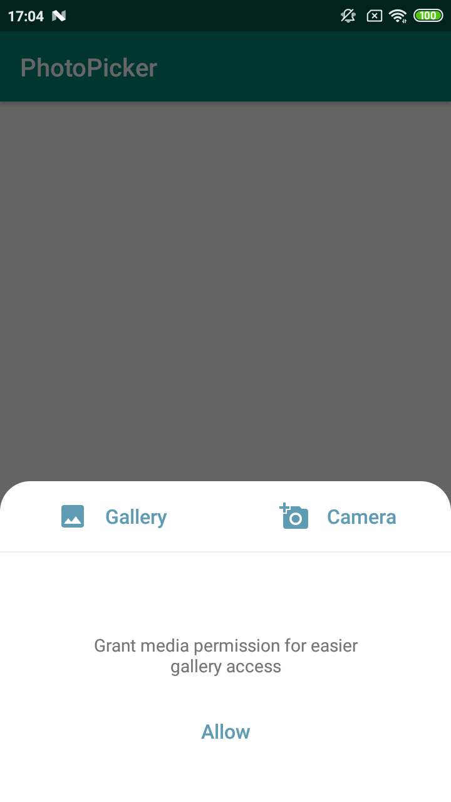
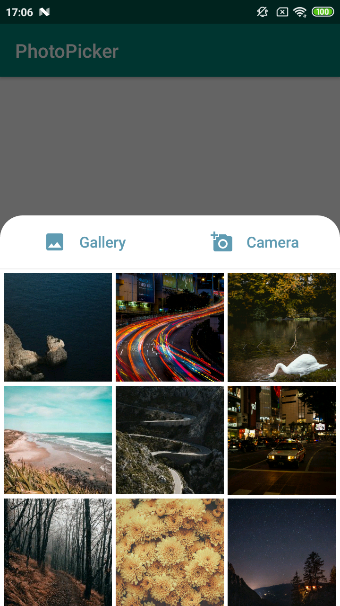
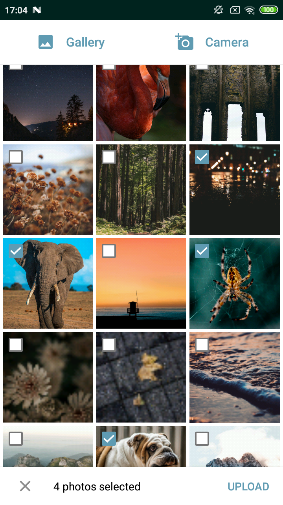

# ChiliPhotoPicker

Library made without DataBinding, RxJava and image loading libraries, to give you opportunity to use it without additional dependencies.

- Picker styled as bottom sheet dialog
- Could be used for single or multiple photos pick
- Allows to choose how images are loaded into ImageView
- Takes responsibility for all needed permissions
- Takes responsibility for fetching gallery/camera result


| No permission                   | Single choice                      | Multiple choice                   |
|:-------------------------------:|:----------------------------------:|:---------------------------------:|
||       |    |

## Setup

Gradle:

Add Jitpack to your root `build.gradle` file:

```
allprojects {
    repositories {
        google()
        jcenter()
        maven { url "https://jitpack.io" }
    }
}
```

Add dependency to application `build.gradle` file, where `x.y.z` is the latest [release version](https://github.com/ChiliLabs/ChiliPhotoPicker/releases):

[](https://jitpack.io/#ChiliLabs/ChiliPhotoPicker)

```
implementation "com.github.ChiliLabs:ChiliPhotoPicker:x.y.z"
```

## Usage

- Create new instance of `ImagePickerFragment`
- Pass preferred `ImageLoader` implementation (ready examples for Glide and Picasso are [here](https://github.com/ChiliLabs/ChiliPhotoPicker/tree/master/sample/src/main/java/lv/chi/picker/loaders))
- Pass your file provider authority, so we can store temporary photo from camera
- Show as dialog

``` kotlin
ImagePickerFragment.newInstance(multiple = true)
            .imageLoader(GlideImageLoader())
            .authority("com.example.your.fileprovider")
            .show(supportFragmentManager, YOUR_TAG)
```

### ImageLoader

We don't want to depend on many image loading libraries, so we have simple `ImageLoader` interface, which you can implement using your preferred library (Glide, Picasso, Coil, etc.)
We have two working examples of `ImageLoader` implementations - using [Glide](https://github.com/ChiliLabs/ChiliPhotoPicker/blob/master/sample/src/main/java/lv/chi/picker/loaders/GlideImageLoader.kt) and [Picasso](https://github.com/ChiliLabs/ChiliPhotoPicker/blob/master/sample/src/main/java/lv/chi/picker/loaders/PicassoImageLoader.kt). You can just copy one of them or write your own implementation

### Callback

Picked photos URIs are returned via callbacks `onImagesPicked` function, so you just need to implement `ImagePickerFragment.Callback` interface in your activity or fragment

## License

```
Copyright 2019 Chili Labs

Licensed under the Apache License, Version 2.0 (the "License");
you may not use this file except in compliance with the License.
You may obtain a copy of the License at

   http://www.apache.org/licenses/LICENSE-2.0

Unless required by applicable law or agreed to in writing, software
distributed under the License is distributed on an "AS IS" BASIS,
WITHOUT WARRANTIES OR CONDITIONS OF ANY KIND, either express or implied.
See the License for the specific language governing permissions and
limitations under the License.
```
